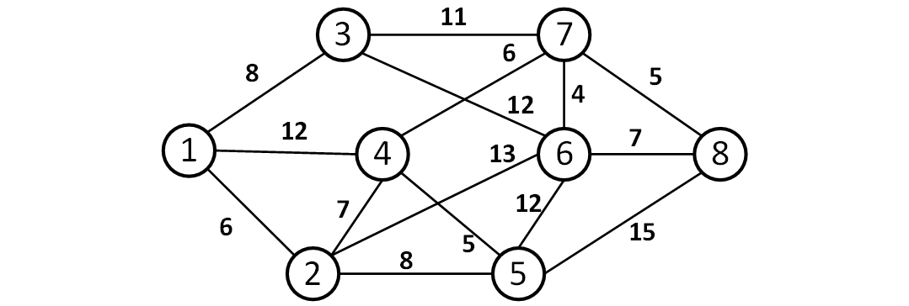
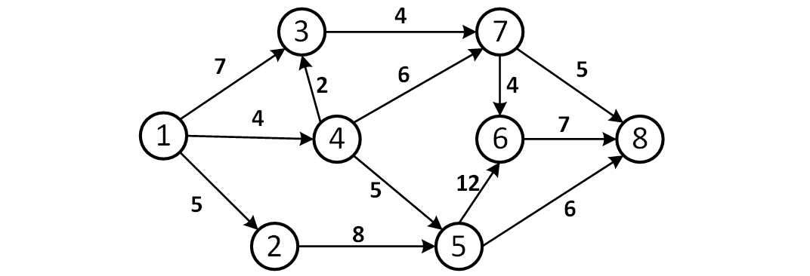

#  Algorithm Design Homework - Campus Network Routing Design

## 算法设计大作业-校园网路由设计

**使用方式：运行 start.py**

---

问题描述：路由是指通过计算机网络把信息从源地址传输到目的地址的活动，也是计算机网络设计中的重点和难点。网络中实现路由转发的硬件设备称为路由器。为了使数据包最快的到达目的地，路由器需要选择最优的路径转发数据包。同时路由器之间的传输容量可能会受到传输带宽等限制，因此不同路由器节点之间的最大传输容量（最大吞吐量）也不同。

---

## 生成网络

1. 设计一个由 n（n 不小于 20）个路由器组成的网络连接平面图。以图中顶点表示路由器，以边表示路由连接路径，存放路由连接的造价以及最大传输容量。

---

## Kruskal & Prim

2. 假设要建设 n 个路由器组成的校园网，只需 n-1 条连接链路，已知网络中任意两个路由器之间建立连接的造价，请至少用两种算法设计一个经济代价最小的路由网络，并对两种不同算法的效率分析和对比。若各个路由器之间的连接造价如下 [图 1](#fig1) 所示，请用以上两种算法找出造价最低的路由连接方式。

图 1 路由器之间的连接造价图

---

## Dinic

3. 若已知一个计算机网络中各路由器间的连接情况，以及各个路由器转发的最大吞吐量（即每秒能转发的数据包数量），请计算从路由器 1 到路由器 n 的网络的最大吞吐量。若各个路由器之间的最大吞吐量如下 [图 2](#fig2) 所示，用上述算法计算从节点 1 到节点 8 的最大吞吐量。

图 2 路由器之间的最大吞吐量图示

---

## AES

4. 若路由器 1 需要向路由器 2 发送一条对安全级别要求较高的消息，需要对传输数据进行加密处理。
这要求在路由器 1 通过一个加密系统对传输数据预先加密，在路由器 2 将传来的数据进行解密。
试利用一种常用的加密/解密算法（如 DES 或 AES ）写一个加密/解密系统。
注意：请同学们自己设计密钥和传输数据，并给出不少于 2 条数据消息对算法正确性进行测试。

---

## GUI

5. 为该校园路由网设计一个人机交互界面，要求可配置网络参数如路由数目、造价等、可计算最大吞吐量等。
